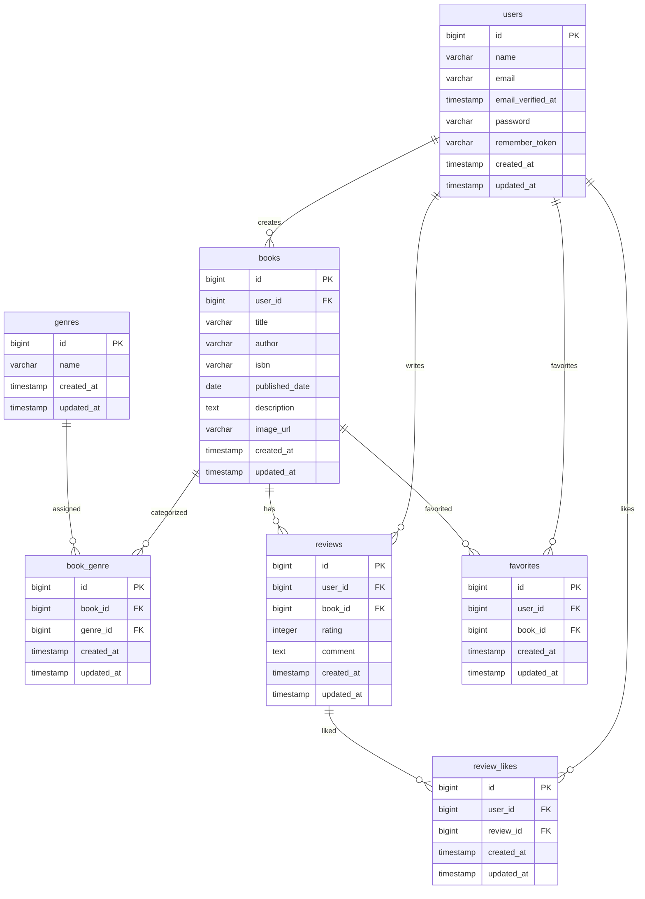
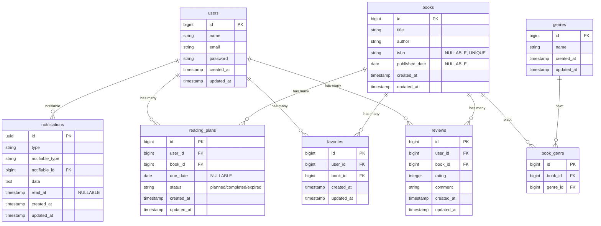

# BookShelf - 書籍レビューアプリ

Laravel 10.x + Sail + MySQL + Vite + Tailwind CSS を使用した書籍レビュー管理アプリです。  
書籍 CRUD、レビュー、ジャンル管理、ランキング、検索、ISBN 連携、公開 API、テスト環境を備えています。

---

🛠 使用技術一覧
本アプリケーションで使用している主要技術スタックを以下にまとめます。

Backend
PHP 8.1

Laravel 10.x

Laravel Fortify（認証）

Laravel Sanctum（API 認証 / SPA 認証）

Laravel Sail（ローカル開発環境）

MySQL 8.x

GuzzleHTTP（Open Library API 連携）

Frontend
Vite

Tailwind CSS 3.x

Alpine.js 3.x

Blade Templates

Infrastructure / Environment
Docker / Docker Compose（Sail）

Mailpit（メール送信テスト）

Testing
PHPUnit 10.x

Laravel Test Components（Feature / Unit）

External API
Open Library API（ISBN 連携）

---

# 🚀 開発環境構築（bookshelf-app を完全再現する手順）

以下の手順を **上から順に実行するだけで、bookshelf-app を完全に再現できます。**

---

1. プロジェクト取得（Git Clone）

git clone https://github.com/Kiichi-funatu/bookshelf-app.git
cd bookshelf-app

2. Composer 依存関係インストール
Fortify / Sanctum / Laravel 本体などをインストールします。

docker run --rm -u "$(id -u):$(id -g)" \
  -v "$(pwd):/var/www/html" \
  -w /var/www/html \
  laravelsail/php82-composer:latest \
  composer install

3. Sail 起動

./vendor/bin/sail up -d

4. .env 設定（必須）
.env.example をコピーします。

cp .env.example .env

Sail 用 DB / Mail 設定

DB_HOST=mysql
MAIL_HOST=mailpit

# ISBN 連携（Open Library API）
# Open Library API は APIキー不要・URL固定のため設定不要

Sanctum（SPA 認証）

SANCTUM_STATEFUL_DOMAINS=localhost,127.0.0.1,localhost:3000
SESSION_DOMAIN=localhost

5. アプリケーションキー生成

sail artisan key:generate

6. DB マイグレーション & 初期データ投入

sail artisan migrate --seed

7. Node 依存関係インストール（Vite / Tailwind / Alpine）
あなたのリポジトリにはすでに package.json / vite.config.js / tailwind.config.js が揃っているため、
新規作成や上書きは不要です。

sail npm install

8. フロントエンドビルド（Vite）

sail npm run dev

9. Fortify（認証）
config/fortify.php により以下が有効化されています：

registration

resetPasswords

emailVerification

updateProfileInformation

updatePasswords

twoFactorAuthentication

リポジトリ内の resources/views/auth/* がそのまま使用されます。
追加設定は不要です。

10. Sanctum（API 認証）
SPA モード（stateful）で動作します。
.env の以下が必須です：

SANCTUM_STATEFUL_DOMAINS=localhost,127.0.0.1,localhost:3000
SESSION_DOMAIN=localhost

11. ISBN 連携（Open Library API）
Open Library API を使用して ISBN から書籍情報を取得します。
APIキー不要・レート制限なし・完全無料で利用できます。

12. 公開 API（認証なし / Sanctum 認証）
routes/api.php に従って動作します。
追加設定は不要です。

🧪 テスト環境構築（Unit / Feature）

1. テスト用 DB 作成
MySQL に testing データベースを作成します。
（phpunit.xml が testing 固定）

2. .env.testing 作成

cp .env .env.testing

修正：

APP_ENV=testing
DB_DATABASE=testing
MAIL_MAILER=array
SESSION_DRIVER=array
QUEUE_CONNECTION=sync

APP_KEY 生成：

sail artisan key:generate --env=testing

3. テスト用マイグレーション

sail artisan migrate --env=testing

4. テスト実行（重要）
あなたの phpunit.xml は phpunit コマンドを使う前提 です。
sail artisan test は phpunit.xml を読みません。

テスト実行

sail phpunit

カバレッジ

sail phpunit --coverage-text

ER図（基本）

ER図（応用）

開発環境 URL

アプリケーション	http://localhost
Mailpit（メール確認）	http://localhost:8025
Vite Dev Server	http://localhost:5173

API エンドポイント一覧

書籍 API

GET	/api/books	書籍一覧
POST	/api/books	書籍登録
GET	/api/books/{id}	書籍詳細
PUT	/api/books/{id}	書籍更新
DELETE	/api/books/{id}	書籍削除

レビュー API

GET	/api/books/{id}/reviews	書籍レビュー一覧
POST	/api/books/{id}/reviews	レビュー投稿

ジャンル API

GET	/api/genres	ジャンル一覧
POST	/api/genres	ジャンル作成

ISBN 連携 API

GET	/api/isbn/{isbn}	Open Library API から書籍情報取得

作成者

船津 輝一
GitHub: https://github.com/Kiichi-funatu
